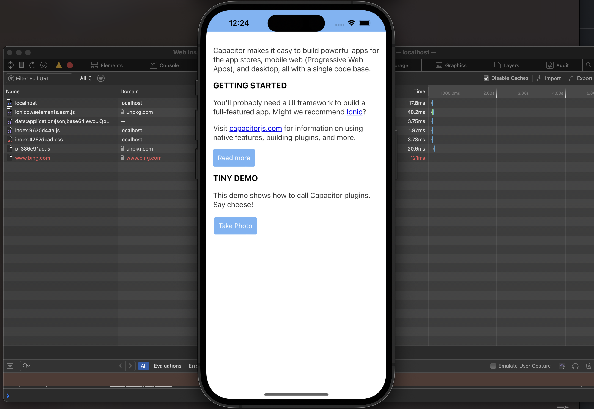

## Update

The issue described below was fixed in capacitor 5.4.1 via https://github.com/ionic-team/capacitor/pull/6908

## Purpose

The purpose of this application is to demonstrate a bug in CapacitorHttp plugin, whereas its patched `window.fetch()` falls back to the web implementation of `fetch()` whenever it is being called with a [`Request`](https://developer.mozilla.org/en-US/docs/Web/API/Request) object.

The `window.onload` function in capacitor-welcome.js makes two requests:
 - `fetch('https://www.google.com')` works as intended and gets handled on the native side
 - `fetch(new Request('https://www.bing.com'))` on the other hand will be handled by web fetch as seen on the screenshot below:

 

 The reason for this seems to be that Capacitor falls back to web fetch whenever the stringified form of the requested resource does not start with http(s). Link: https://github.com/ionic-team/capacitor/blob/f378edae9e87901ae2edbf8c339e401a60bfddf0/ios/Capacitor/Capacitor/assets/native-bridge.js#L426

 However, an object created via the `Request()` constructor will be stringified to `"[object Request]"` (it has a url field that represents the url of the requested resource).

 This is, however, a valid parameter to `fetch()`. Below quote from MDN: https://developer.mozilla.org/en-US/docs/Web/API/fetch#resource

> `resource`
> This defines the resource that you wish to fetch. This can either be:
>  - A string or any other object with a stringifier — including a `URL` object — that provides the URL of the resource you want to fetch.
>  - A `Request` object.

## Created with Capacitor Create App

This app was created using [`@capacitor/create-app`](https://github.com/ionic-team/create-capacitor-app),
and comes with a very minimal shell for building an app.

### Running this example

Follow the Capacitor documentation.

You need to run iOS or Android to reproduce the issue with CapacitorHttp plugin. For example, to build & run on iOS you can use the command below
```bash
npm run build && npx cap sync && npx cap run ios
```
